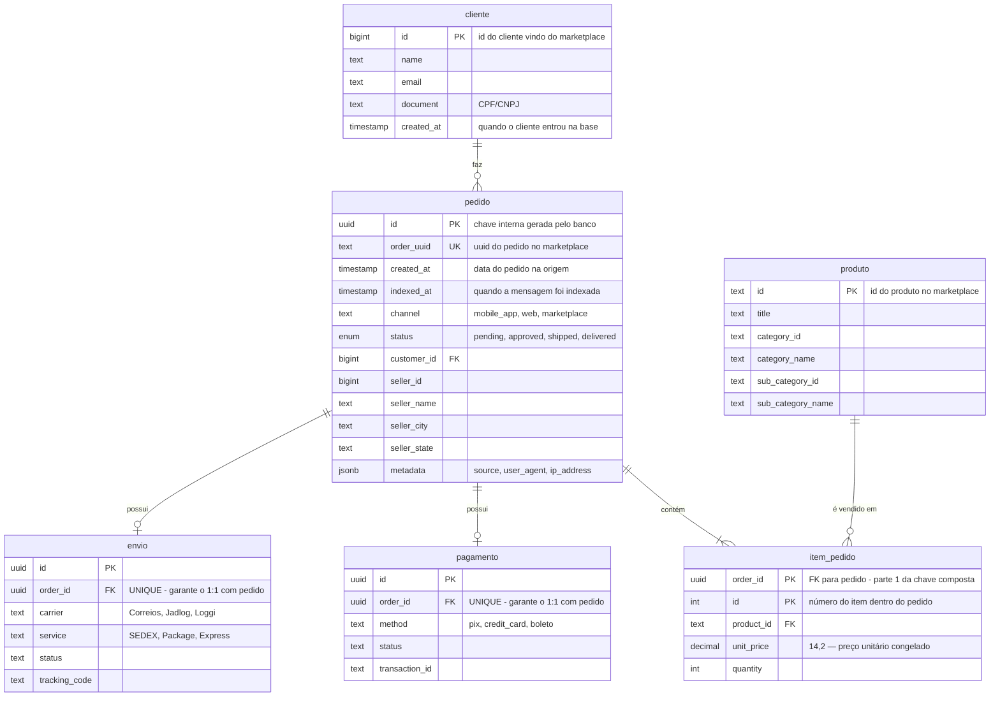

# DER — Banco de Dados

Modelo relacional que recebe os pedidos consumidos do Google Cloud Pub/Sub.
O diagrama abaixo é renderizado automaticamente pelo GitHub.

## Cardinalidades

| Relacionamento | Cardinalidade | Regra |
| --- | --- | --- |
| `cliente` → `pedido` | 1 : N | Um cliente tem zero ou mais pedidos; todo pedido tem exatamente um cliente. |
| `pedido` → `item_pedido` | 1 : N | Todo pedido tem pelo menos um item. `ON DELETE CASCADE`. |
| `produto` → `item_pedido` | 1 : N | Um produto aparece em zero ou mais itens. `ON DELETE RESTRICT` — produto usado não pode ser apagado. |
| `pedido` → `pagamento` | 1 : 0..1 | `order_id` é `UNIQUE`. `ON DELETE CASCADE`. |
| `pedido` → `envio` | 1 : 0..1 | `order_id` é `UNIQUE`. `ON DELETE CASCADE`. |

## Decisões de modelagem

**Chave interna vs. chave do marketplace.** `pedido.id` é um `UUID` gerado pelo
banco e usado nas FKs; `pedido.order_uuid` guarda o identificador da origem
(`ORD-2025-0001`) com `UNIQUE`. É esse `order_uuid` que a API expõe em
`/orders/{uuid}` e é ele que torna o consumo idempotente: mensagem reentregue
pelo Pub/Sub encontra o pedido existente e não duplica nada.

**`indexed_at` atende ao requisito "registre a hora que a mensagem foi indexada".**
É distinto de `created_at`: `created_at` é a data do pedido na origem
(vem no payload) e `indexed_at` é preenchido pelo banco com `DEFAULT now()` no
instante em que o consumer persiste a linha.

**Totais não são colunas.** Nem `pedido.total` nem `item_pedido.total` existem.
O enunciado pede cálculo dinâmico, então a API deriva
`item.total = unit_price × quantity` e `pedido.total = Σ item.total`. Evita
valor desatualizado no banco.

**`unit_price` fica congelado no item.** O preço é gravado em `item_pedido`,
não lido de `produto`. Um pedido antigo continua valendo o preço praticado na
época, mesmo que o produto mude de preço depois.

**Categoria mora em `produto`.** O payload traz a categoria dentro de cada item,
mas ela descreve o produto, não a venda. Normalizar para `produto` elimina a
repetição em cada item vendido. Categoria e subcategoria estão desnormalizadas
em colunas (`category_id`/`category_name`/`sub_category_id`/`sub_category_name`)
porque o payload só entrega esses quatro campos e não há hierarquia mais funda
para justificar tabelas próprias.

**Seller desnormalizado em `pedido`.** O enunciado exige minimamente as tabelas
`pedido`, `cliente`, `produto` e `item_pedido`. O seller aparece só com quatro
campos e nenhum atributo próprio a manter, então ficou como colunas do pedido,
com índice em `seller_id` para o filtro `?seller.id=` e para o
`/orders/financial-summary`.

**`status` como `ENUM` no banco.** O tipo `OrderStatus` hoje aceita
`pending`, `approved`, `shipped` e `delivered`. O consumer traduz os nomes do
enunciado na entrada (`created` → `pending`, `paid` → `approved`).
⚠️ O enunciado também lista `canceled`, que ainda não existe no enum — pedidos
cancelados são descartados pelo consumer em vez de persistidos. Ajustar isso
exige nova migration e está fora do escopo deste documento.

**`metadata` como JSONB.** `source`, `user_agent` e `ip_address` são dados de
telemetria sem consulta prevista. `JSONB` guarda o bloco inteiro sem travar o
schema se a origem mandar campos novos.

## Índices

| Tabela | Índice | Serve a |
| --- | --- | --- |
| `pedido` | `order_uuid` (UNIQUE) | `/orders/{uuid}` e idempotência do consumer |
| `pedido` | `customer_id` | filtro `?customer.id=` |
| `pedido` | `seller_id` | filtro `?seller.id=` e `financial-summary` |
| `pedido` | `status` | filtro `?status=` e agregação `by_status` |
| `pedido` | `created_at` | ordenação por data e filtro de período |
| `item_pedido` | `product_id` | filtro `?product.id=` |
| `pagamento` | `order_id` (UNIQUE) | garante o 1:1 e a agregação `by_payment_method` |
| `envio` | `order_id` (UNIQUE) | garante o 1:1 |

## Origem do schema

O DDL fica em [prisma/migrations/](../prisma/migrations/) e o modelo em
[prisma/schema.prisma](../prisma/schema.prisma). Os nomes das tabelas estão em
português (`@@map`) para bater com o enunciado; o código usa os nomes de modelo
em inglês.
